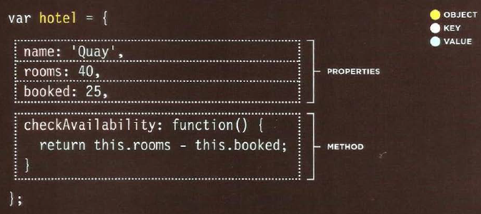
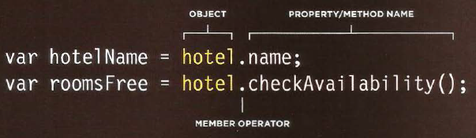

# Readings : Problem Domain, Objects, and the DOM

## what is an object?
An object groups together a set of variables and functions to create a model of a something you  would recognize from the real world. 

&nbsp;

> In an object, variables and functions take on new names.

&nbsp;

what are  **VARIABLES** called in an object and what is their job? 
- They become known as Properties 
- They tell us about the object.

&nbsp;

&nbsp;

what are  **FUNCTIONS** called in an object and what is their job? 
- If a function is part of an object, it is called a method. 
- Methods represent tasks that are associated with
the object.

&nbsp;

&nbsp;

> properties and methods have a name and a value. 
> In an object, that name is called a key.

## How to create an object?

  

&nbsp;

&nbsp;

# How to access the attributes of an object?

# References:
1. From the Duckett JS book
      - Chapter 3: “Object Literals” (pp.100-105)
      -  Chapter 5: “Document Object Model” (pp.183-242)