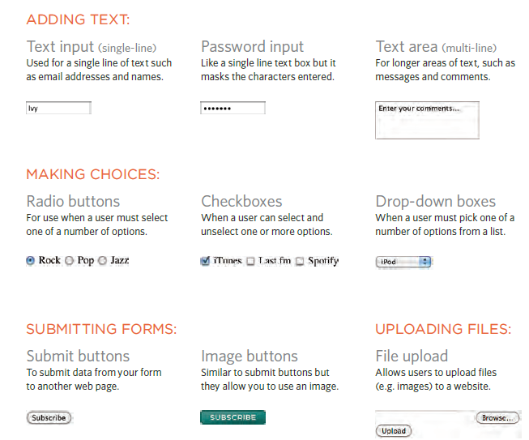
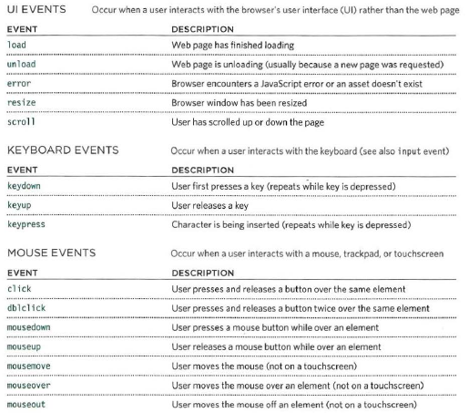
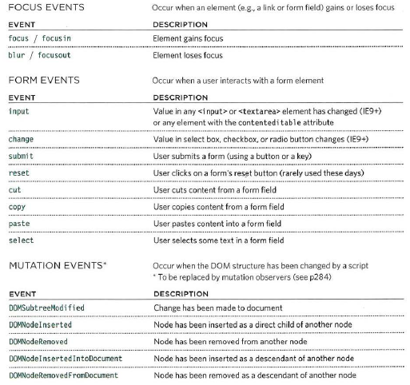

# Read: 09 - Forms and Events

## Readings : Forms and JS Events
---

# What are forms?
- A form refers to different elements that allow you to collect information from visitors to your site.

&nbsp;

 >Whether you are adding a simple search box to your website or you need to create more complicated insurance applications, HTML forms give you a set of elements to collect data from your users.

&nbsp;

 ## Why do we use forms ?
 1. they enable users to search,
 2. they allow users
to perform other functions
online. (Ex. registering.)

&nbsp;

## Some controls related to forms:

&nbsp;

##  How forms work?

 1. A user fills in a form and then presses a button
to submit the information to the server.

2. The server creates a new page to send back to the
browser based on the information received.

3. The name of each form control is sent to the server along with the value the user enters or selects.

4. The server processes the information using a programming language such as PHP, C#, VB.net,
or Java. It may also store the information in a database.

&nbsp;

> Form controls live inside a <form> element.

&nbsp;

## what is an action?
Every <form> element requires an action attribute. Its value is the URL for the page on the server that will receive the information in the form when it is submitted.

&nbsp;

&nbsp;

Forms can be sent using one of
two methods: get or post.

 - get method: With the get method, the values from the form are added to the end of the URL specified in the action attribute.
 - post method: With the post method the values are sent in what are known as HTTP headers.

&nbsp;

# Events

Definition: 
1. INTERACTIONS CREATE EVENTS.
2. EVENTS TRIGGER CODE.
3. CODE RESPONDS TO USERS.

&nbsp;

&nbsp;

&nbsp;

## Java scripts dealing with elements:
1. Select t he element
node(s) you want the
script to respond to.

2. Indicate which event on
the selected node(s) will
trigger the response.

3. State the code you want
to run when the event
occurs.

&nbsp;

&nbsp;

&nbsp;

&nbsp;

&nbsp;

&nbsp;

&nbsp;

&nbsp;

&nbsp;

# Refernces:

1. From the Duckett HTML book:
     -   Chapter 7: “Forms” (p.144-175)
     -   Chapter 14: “Lists, Tables & Forms” (pp.330-357)

2. From the Duckett JS book:
   - Chapter 6: “Events” (pp.243-292)