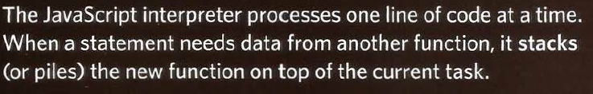

# Read: 10 - JS Debugging

## ORDER OF EXECUTION:

- To find the source of an error, it helps to know how scripts are processed.
- The order in which statements are executed can be complex; some tasks cannot complete until another statement or function has finished.

## EXECUTION CONTEXT

- Every statement in a script lives in one of three
execution contexts:
1. GLOBAL CONTEXT: Code that is in the script, but not in a function.

> There is only one global context in any page.

&nbsp;

2. FUNCTION CONTEXT: Code that is being run within a function.

> Each function has its own function context.

&nbsp;

3. EVAL CONTEXT (NOT SHOWN): Text is executed like code in an internal function.

&nbsp;

- Each time a script enters a new execution context, there are two phases
of activity:
1. PREPARE:
    - The new scope is created
    - Variables, functions, and arguments are created
    - The value of the this keyword is determined

2. EXECUTE:
      -  Now it can assign values to variables
      -  Reference functions and run their code
      -  Execute statements

## Hoisting 
you can sometimes, Call functions before they have been declared and  assign a value to a va ria ble that has not yet been declared. (why?)

- This is because any variables and functions within
each execution context are created before they are
executed.

## What are the Types of errors in JS ?

1. RangeError
This is thrown when a number is outside an allowable range of values.

&nbsp;

2. ReferenceError
This error is thrown when a reference made to a variable/item is broken. That is the variable/item doesn’t exist.

&nbsp;

3. SyntaxError
This is the most common error we encounter. This error occurs when we type code that the JS engine can understand.

&nbsp;

4. TypeError
TypeError is used to indicate an unsuccessful operation when none of the other NativeError objects are an appropriate indication of the failure cause.

&nbsp;

5. URIError
This indicates that one of the global URI handling functions was used in a way that is incompatible with its definition.

&nbsp;

6. EvalError
This is used to identify errors when using the global eval() function.

&nbsp;

7. InternalError
This error occurs internally in the JS engine, especially when it has too much data to handle and the stack grows way over its critical limit.

&nbsp;

#Refernces:
1. From the Duckett JS book:
- JavaScript book, Ch. 10, “Error Handling & Debugging”