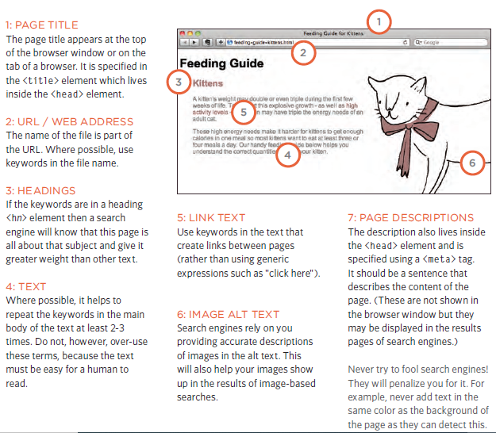

# Read: 11 - Assorted Topics

## Images

- You can size the image by using CSS attributes
```
img{
    width: 500px;
    height:500px;
}
```
<p>&nbsp;</p>

## Some dimensions standard with images(width x height): 
1. Small portrait: 220 x 360
2. Small landscape: 330 x 210
3. Feature photo: 620 x 400
<p>&nbsp;</p>

### Aligning an image with the `float` property:
```
img.align-left {
float: left;
margin-right: 10px;}
```

<p>&nbsp;</p>

### How to center an image:
1. On the containing element, you can use the text-align property with a value of center.

2. On the image itself, you can use the use the margin property
and set the values of the left and right margins to auto.

<p>&nbsp;</p>

# How to add a background image:
We use the following syntax with the element we want to add the background to.

```
p {
background-image: url("images/pattern.gif");}
```
<p>&nbsp;</p>


## What is (SEO)?

- Search Engine Optimization (SEO ): the practice of trying
to help your site appear nearer the top of search engine results when people look for the topics that your website covers.

- on-page SEO:On-page techniques are the methods you can use on your web pages to improve their
rating in search engines.

- off-page SEO:Getting other sites to link to you
is just as important as on-page techniques. Search engines help
determine how to rank your site by looking at the number of other sites that link to yours.

<p>&nbsp;</p>



<p>&nbsp;</p>
<p>&nbsp;</p>

### Six steps that will help identify the right keywords and phrases for any site.
1. Brainstorm
2. Organize
3. Research
4. Compare
5. Refine
6. Map

<p>&nbsp;</p>
<p>&nbsp;</p>
<p>&nbsp;</p>


# References:

1. From the Duckett HTML book:
- Chapter 16: “Images” (pp.406-427)
- Chapter 19: “Practical Information” (476-492)