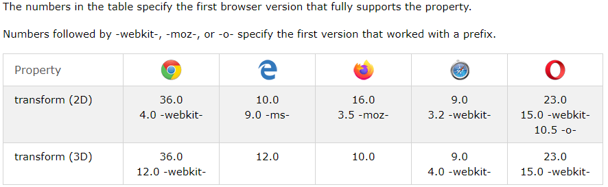

# Read: 14a - CSS Transforms, Transitions, and Animations


- The transform property comes in two different settings, two-dimensional and three-dimensional.

<p>&nbsp;</p>


## Transform Syntax
The actual syntax for the transform property is quite simple, including the transform property followed by the value.
<p>&nbsp;</p>

```
div {
  -webkit-transform: scale(1.5);
     -moz-transform: scale(1.5);
       -o-transform: scale(1.5);
          transform: scale(1.5);
}
```


>each prefix allows for a different browser support.

<p>&nbsp;</p>




<p>&nbsp;</p>
<p>&nbsp;</p>

The transform property applies a 2D or 3D transformation to an element. This property allows you to rotate, scale, move, skew, etc., elements

<p>&nbsp;</p>
<p>&nbsp;</p>


## 2D Rotate

- The rotate value provides the ability to rotate an element from 0 to 360 degrees.

- Using a positive value will rotate an element clockwise, and using a negative value will rotate the element counterclockwise.

code ex:

```
{
  transform: rotate(20deg);
}
```

<p>&nbsp;</p>


## 2D Scale
Using the scale value will allow you to change the appeared size of an element. 

- The default scale value is 1.

- any value less than one and greater than zero will shrink the object.

- anything greater than one will make the object bigger.


code ex:
```
{
  transform: scale(.75);
}
```
<p>&nbsp;</p>
<p>&nbsp;</p>

## 2D translation:
you can translate an object in 3d space by the following formula.
```
{
  transform: translateX(-10px);
}
```

<p>&nbsp;</p>
<p>&nbsp;</p>

## 2D Skew 
skew, is used to distort elements on the horizontal axis, vertical axis, or both.

code ex:

```
{
  transform: skewX(5deg);
}
```
<p>&nbsp;</p>
<p>&nbsp;</p>


---
References:
1. Read this article on CSS Transforms
2. Read this article on CSS Transitions & Animations
3. 8 simple CSS3 transitions that will wow your users
4. 6 Buttons animated
5. CSS3 Animations: Keyframes
6. 404
7. Pure CSS Bounce Animation
