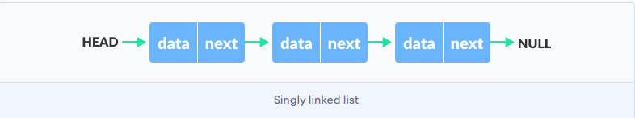

Read: Linked Lists

## What is a Linked List?
 - A data structure that contains nodes that links/points to the next node in the list.

 
 

 ## What are the two types of Linked Lists?
 - There are two types of Linked List - Singly and Doubly

 
 

## Differences between linked lists and arrays:
- arrays are stored in contiguous blocks of data whereas linked lists nodes can be stored separately.
- arrays can be faster in finding particular elements inside it whereas linked lists need time to find a particular element.
- linked lists are faster in adding and deleting nodes and arrays are slower in deleting one of its elements.

 
 

## What is a Singly Linked List?

- It is the most common List where Each node has data and a pointer to the next node.
- Keep in mind: Singly refers to the number of references the node has. A Singly linked list means that there is only one reference, and the reference points to the Next node in a linked list.
 
 

 
 

## Some Terminology.

- Doubly - Doubly refers to there being two (double) references within the node. A Doubly linked list means that there is a reference to both the Next and Previous node.

- Node - Nodes are the individual items/links that live in a linked list. Each node contains the data for each link.

- Next - Each node contains a property called Next. This property contains the reference to the next node.
- Head - The Head is a reference of type Node to the first node in a linked list.

- Current - The Current is a reference of type Node to the node that is currently being looked at. When traversing, you create a new Current variable at the Head to guarantee you are starting from the beginning of the linked list.

 
 

> When making your Node class, consider requiring a value to be passed in to require that each node has a value.
 
 

# References:

1. [ Linked Lists ](https://codefellows.github.io/common_curriculum/data_structures_and_algorithms/Code_401/class-05/resources/singly_linked_list.html) 
2. [What’s a Linked List, Anyway pt1](https://medium.com/basecs/whats-a-linked-list-anyway-part-1-d8b7e6508b9d) 
3. [What’s a Linked List, Anyway pt2](https://medium.com/basecs/whats-a-linked-list-anyway-part-2-131d96f71996) 