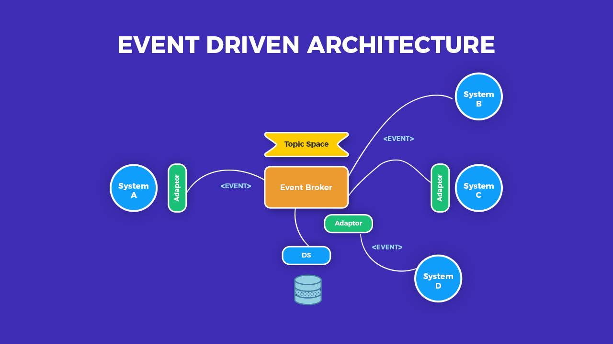
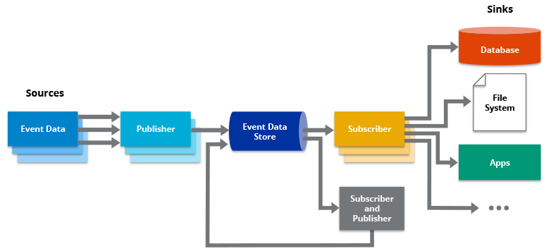

# Readings: Event Driven Architecture

<br/>



<br/>

## What is Event Driven Architecture?
- Event-driven architecture (EDA) is a software architecture paradigm promoting the production, detection, consumption of, and reaction to events.
<br/>
<br/>
<br/>



## Event Structure:
- An event can be made of two parts, the event header and the event body. The event header might include information such as event name, time stamp for the event, and type of event. The event body provides the details of the state change detected. An event body should not be confused with the pattern or the logic that may be applied in reaction to the occurrence of the event itself.

<br/>
<br/>

```js
(() => {
  'use strict';

  class EventEmitter {
    constructor() {
      this.events = new Map();
    }

    on(event, listener) {
      if (typeof listener !== 'function') {
        throw new TypeError('The listener must be a function');
      }
      let listeners = this.events.get(event);
      if (!listeners) {
        listeners = new Set();
        this.events.set(event, listeners); 
      }
      listeners.add(listener);
      return this;
    }

    off(event, listener) {
      if (!arguments.length) {
        this.events.clear();
      } else if (arguments.length === 1) {
        this.events.delete(event);
      } else {
        const listeners = this.events.get(event);
        if (listeners) {
          listeners.delete(listener);
        }
      }
      return this;
    }

    emit(event, ...args) {
      const listeners = this.events.get(event);
      if (listeners) {
        for (let listener of listeners) {
          listener.apply(this, args);
        }
      }
      return this;
    }
  }

  this.EventEmitter = EventEmitter;
})();
```
<br/>
<br/>

```js
const events = new EventEmitter();
events.on('foo', () => { console.log('foo'); });
events.emit('foo'); // Prints "foo"
events.off('foo');
events.emit('foo'); // Nothing will happen
```
<br/>
<br/>

## Review, Research, and Discussion
---


1. What’s the difference between a FIFO and a standard queue?
- Standard queues provide at-least-once delivery, which means that each message is delivered at least once. 

- FIFO queues provide exactly-once processing, which means that each message is delivered once and remains available until a consumer processes it and deletes it.

<br/>
<br/>

2. How can the server be assured a message was properly received? 
- Using tests and methods can help with that.
<br/>
<br/>

3. What classic design pattern is best represented by event driven programming?

- he  Singleton pattern: it  is one of the simplest design patterns in Java. This type of design pattern comes under creational pattern as this pattern provides one of the best ways to create an object.
<br/>

- This pattern involves a single class which is responsible to create an object while making sure that only single object gets created. This class provides a way to access its only object which can be accessed directly without need to instantiate the object of the class.
<br/>
<br/>

4. How do you test an event driven system?
- In short — service tests for event-driven systems operate on events for inputs and events for outputs. Another by-product of a decoupled architecture is often an absence of mocks and stubs in the service test code, which stems from inherent 'unawareness' the service has of other services.
<br/>
<br/>

<br/>

## Term
- FIFO Queue: FIFO (First-In-First-Out) queues are designed to enhance messaging between applications when the order of operations and events is critical, or where duplicates can't be tolerated. Examples of situations where you might use FIFO queues include the following:

- To make sure that user-entered commands are run in the right order.

- To display the correct product price by sending price modifications in the right order.

- To prevent a student from enrolling in a course before registering for an account.


- Pub/Sub: enables you to create systems of event producers and consumers, called publishers and subscribers.

<br/>
<br/>

<br/>

## Preview

1. Which 3 things had you heard about previously and now have better clarity on?
- socket, databases and aut.

2. Which 3 things are you hoping to learn more about in the upcoming lecture/demo?
- sql.

3. What are you most excited about trying to implement or see how it works?
- A full project.


<br/><br/><br/>
<br/>
<br/>
<br/><br/>

# References: 
[Understanding the Event-driven Architecture](https://softobiz.com/understanding-the-event-driven-architecture/)
