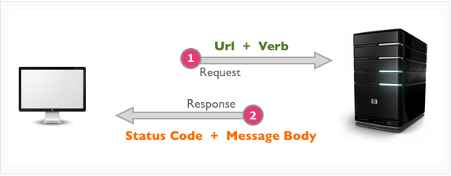

# Readings: AWS: Cloud Servers

## What is a virtual machine amnager?
- Hypervisor: a type of software that allows you to run an operating system within an operating system. example: Virtual box, vm-ware.
 
 

### why use a virtual machine?
1. Trying a new O.S.
2. Testing a new application.
 
 

## Virtualization and Cloud Computing

### what is Virtualization?
- It allows us to better utilize the resources we have available in a machine.
 
 

### How does this help us ?

- Install a software "hypervisor" that allows us to create virtual machine. Where we can put several virtual machines on one physical machine.
 
 

- In Cloud computing we have servers running this virtual machines for us.
- These servers exist in a data center which is a large warehouse that holds multiple servers; these can be anywhere.
 
 

### What is Amazon EC2?
- Amazon Elastic Compute Cloud (Amazon EC2) is a web service that provides secure, resizable compute capacity in the cloud.

 
 

# Review

## Describe the Web-Request-Response-Cycle
- The web is a cycle of requests and responses that flow between clients and servers.

 

## Explain what a “server” is, as it relates to the WRRC
- All resources are hosted on a server. The server’s location on the web can be identified by its IP address, however, IP addresses aren’t particularly user friendly, and instead we use URLS (such as http://www.google.com) to search for a resource.
 

- Once the client’s request has reached the server, the server will search for and return the information the client is requesting. Often times, this means querying a database, loading the information into an html page, and returning the HTML text to the user in the body of the HTTP response.
 
 
 

## What does it mean to “deploy” an application?
- Software deployment refers to the process of running an application on a server or device.
- in other words, Deploying your application means putting it on a Web server so that it can be used either through the Internet or an intranet. This Web server might be your local UNIX system, while you develop and debug your application to check that the application is performing as you expect, or a different UNIX system for users of your application.

 
 
 

# Document the following Vocabulary Terms
Term:
- **Server:**  A server is a computer or system that provides resources, data, services, or programs to other computers, known as clients, over a network. In theory, whenever computers share resources with client machines they are considered servers.This means that a device could be both a server and a client at the same time.
 

- **Pub/Sub:**  In software architecture, publish–subscribe is a messaging pattern where senders of messages, called publishers, do not program the messages to be sent directly to specific receivers, called subscribers, but instead categorize published messages into classes without knowledge of which subscribers, if any, there may be. Similarly, subscribers express interest in one or more classes and only receive messages that are of interest, without knowledge of which publishers, if any, there are.
 

- **WRRC:**  web request-response cycle. represents how every web service or process done when a client does some action in the user interface.
 
 
 

## Preview
- Which 3 things had you heard about previously and now have better clarity on?
- trees.
 

- Which 3 things are you hoping to learn more about in the upcoming lecture/demo?
- AWS.
 

- What are you most excited about trying to implement or see how it works?
- Let's see.
 
 
 
 

# References:
[Virtual Machines ](https://www.youtube.com/watch?v=yIVXjl4SwVo)

[VMS and the Cloud ](https://www.youtube.com/watch?v=l0DfHUWMjsU)

[AWS EC2](https://aws.amazon.com/ec2/)

[EC2 For Humans](https://www.youtube.com/watch?v=lZMkgOMYYIg)

[Elastic Beanstalk](https://www.youtube.com/watch?v=SrwxAScdyT0)