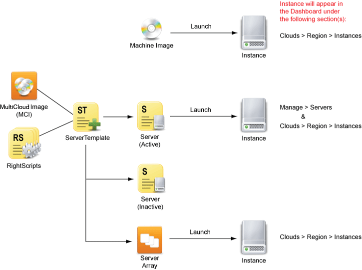

# Readings: AWS: S3 and Lambda

## What is AWS Lambda?
- AWS Lambda is a serverless computing service provided by Amazon Web Services (AWS). Users of AWS Lambda create functions, self-contained applications written in one of the supported languages and runtimes, and upload them to AWS Lambda, which executes those functions in an efficient and flexible manner.
 
 

## How does AWS Lambda work?

- Each Lambda function runs in its own container. When a function is created, Lambda packages it into a new container and then executes that container on a multi-tenant cluster of machines managed by AWS. Before the functions start running, each function’s container is allocated its necessary RAM and CPU capacity. Once the functions finish running, the RAM allocated at the beginning is multiplied by the amount of time the function spent running. The customers then get charged based on the allocated memory and the amount of run time the function took to complete.
 
 

## what is CDN ? 
- Content Delivery Network (CDN):A Content Delivery Network (CDN) is a geographically distributed group of servers that work together to provide fast delivery of Internet content. A CDN allows for the fast transfer of data needed for loading Internet content including HTML pages, javascript files, stylesheets, images, and videos.
 
 

> CDNs work through servers nearest to the website visitor respond to the request.
 
 

## benefits of CDN : 
1. It speeda up the delivery of Internet content
2. It helps protect your website against certain forms of cyber attacks, such as Denial of Service attacks. 
 
 

> It protects against these threats because CDNs allow for the handling of more traffic and withstanding hardware failure better than many origin servers. 

 
 

## to complete a Serverless stack you’ll need:

* a computing service;
* a database service; and
* an HTTP gateway service.
 
 
 
 

## Review 
---

1. Describe “The Cloud”
- it's a term used to describe a global network of servers, each with a unique function. The cloud is not a physical entity, but instead is a vast network of remote servers around the globe which are hooked together and meant to operate as a single ecosystem.
 
 

2. What is auto-scaling?
- AWS Auto Scaling monitors your applications and automatically adjusts capacity to maintain steady, predictable performance at the lowest possible cost. Using AWS Auto Scaling, it’s easy to setup application scaling for multiple resources across multiple services in minutes. 

 
 

3. What is bandwidth?
- The maximum amount of data transmitted over an internet connection in a given amount of time. 
 
 

4. How do cloud providers compute service costs?
- cloud providers determine the expense to maintaining the network. They start by calculating costs for network hardware, network infrastructure maintenance, and labor. These expenses are added together and then divided by the number of rack units a business will need for its IaaS cloud.
 
 
 

## Document the following Vocabulary Terms
---

1. Server Instances :
- instance: A virtual machine running in the cloud.
-  server : The collection of properties and attributes that define a virtual machine that has run, will run, or is running in the cloud.
 
 

 
 

> When you launch a Server, an Instance will be launched in the specified cloud infrastructure. You cannot launch a Server without subsequently launching an Instance. However, you can launch an Instance directly from a machine image.

 
 
 

2. Containers: A container is a standard unit of software that packages up code and all its dependencies so the application runs quickly and reliably from one computing environment to another.
 
 

3. Cloud Services: Cloud services are services available via a remote cloud computing server rather than an on-site server. These scalable solutions are managed by a third party and provide users with access to computing services such as analytics or networking via the internet.
 
 

4. Cloud Architecture: Cloud architecture is the way technology components combine to build a cloud, in which resources are pooled through virtualization technology and shared across a network. The components of a cloud architecture include:
- A front-end platform (the client or device used to access the cloud).
- A back-end platform (servers and storage).
- A cloud-based delivery model.
- A network.
 
 

5. AWS: Amazon Web Services is a subsidiary of Amazon providing on-demand cloud computing platforms and APIs to individuals, companies, and governments, on a metered pay-as-you-go basis.
 
 

6. EC2/Beanstalk vs Heroku: 
- Amazon Elastic Compute Cloud (Amazon EC2) is a web service that provides secure, resizable compute capacity in the cloud. It is designed to make web-scale cloud computing easier for developers.

- AWS Elastic Beanstalk is an orchestration service offered by Amazon Web Services for deploying applications which orchestrates various AWS services, including EC2, S3, Simple Notification Service, CloudWatch, autoscaling, and Elastic Load Balancers.

- Heroku is a Platform as a Service (PaaS) product;

 
 

<table style="width: 100%">
<tbody>
<tr style="background-color: #ad4c50; ">
<td style="padding: 7px; text-align: center; width: 20%; color: white; font-size: 18px;"><strong>Service</strong></td>
<td style="padding: 7px; text-align: center; width: 40%; color: white; font-size: 18px;"><strong>AMAZON WEB SERVICES</strong></td>
<td style="padding: 7px; text-align: center; width: 40%; color: white; font-size: 18px;"><strong>HEROKU</strong></td>
</tr>
<tr>
<td style="padding: 7px;background: #black;">
Offered by
</td>
<td style="padding: 7px;background: #black;">
Amazon hosted on proprietary servers
</td>
<td style="padding: 7px;background: #black;">
Salesforce hosted on Amazon Web Services
</td>
</tr>
<tr>
<td style="padding: 7px;">
Pricing
</td>
<td style="padding: 7px;">
Pay-as-you-go
</td>
<td style="padding: 7px;">
Pay-as-you-go
</td>
</tr>
<tr>
<td style="padding: 7px;background: #black;">
Main Offerings
</td>
<td style="padding: 7px;background: #black;">

Platform as a Service <strong>(Elastic Beanstalk)</strong>

Infrastructure as a Service <strong>(Elastic Compute Cloud)</strong>

</td>
<td style="padding: 7px;background: #black;">
Platform as a Service
</td>
</tr>
<tr>
<td style="padding: 7px;">
Concept
</td>
<td style="padding: 7px;">

Ready platform for rapid app deployment <strong>(Elastic Beanstalk)</strong>

Infrastructure, which must be set up before deployment and managed afterwards <strong>(Elastic Compute Cloud)</strong>

</td>
<td style="padding: 7px;">
Ready platform for rapid app deployment
</td>
</tr>
<tr>
<td style="padding: 7px;background: #black;">
Supported platforms
</td>
<td style="padding: 7px;background: #black;">
Runs environments for Ruby, NodeJS, Python, Go, Docker, PHP, and .NET apps
</td>
<td style="padding: 7px;background: #black;">
Runs environments for Ruby, Python, PHP, Clojure, Go, Java, Scala, and Node.js apps
</td>
</tr>
<tr>
<td style="padding: 7px;">
Scaling
</td>
<td style="padding: 7px;">

Supports automatic scaling for EC2 and Beanstalk based on time and metrics

Can set up the AutoScale feature before deploying your application

</td>
<td style="padding: 7px;">
Supports manual scaling with the Scaling slider in Dashboard or via a Command Line Interface
</td>
</tr>
<tr>
<td style="padding: 7px;background: #black;">
Geographic availability
</td>
<td style="padding: 7px;background: #black;">
Throughout the world
</td>
<td style="padding: 7px;background: #black;">
US and Europe
</td>
</tr>
<tr>
<td style="padding: 7px;">
Main Features
</td>
<td style="padding: 7px;">

<strong>Elastic Beanstalk</strong> Capacity Provisioning Load Balancing Auto-Scaling App Health Monitoring 

<strong>Elastic Compute Cloud</strong> Ready templates for deployment Multiple configurations (CPU, RAM, etc.)

</td>
<td style="padding: 7px;">
Capacity Provisioning Database Rollback Application Rollback Manual Vertical and Horizontal Scaling App Health Monitoring Full GitHub Integration
</td>
</tr>
<tr>
<td style="padding: 7px; background: #black;">
Architecture
</td>
<td style="padding: 7px; background: #black;">
Web server/load balancer Platform Operating System Application tier Database tier
</td>
<td style="padding: 7px; background: #black;">
Web server/load balancer Platform Operating System Application tier Database tier
</td>
</tr>
<tr>
<td style="padding: 7px;">
Built-in Tools for Management and Monitoring
</td>
<td style="padding: 7px;">
AWS Management Console AWS Command Line Interface (AWS CLI) AWS CloudWatch
</td>
<td style="padding: 7px;">
Heroku Command Line Heroku Application Metrics Heroku Connect Heroku Status
</td>
</tr>
<tr>
<td style="padding: 7px; background: #black; border-bottom: 2px solid #ad4c50;">
Service Level  Agreements
</td>
<td style="padding: 7px; background: #black; border-bottom: 2px solid #4caf50;">
Available for Elastic Compute Cloud
</td>
<td style="padding: 7px; background: #black; border-bottom: 2px solid #3398FF;">
Available for Enterprise projects
</td>
</tr>
</tbody>
</table>

 
 
 
 
 

## Preview

- Which 3 things had you heard about previously and now have better clarity on?
- AWS.
- Which 3 things are you hoping to learn more about in the upcoming lecture/demo?
- More Aws
- What are you most excited about trying to implement or see how it works?
- Deploying to AWS from GitHub.
 
 
 
 
 

## References :
[AWS S3](https://aws.amazon.com/s3/)

[AWS Lambda Basics](https://www.serverless.com/aws-lambda)

[AWS Lambda Functions](https://aws.amazon.com/lambda/)

[CDN](https://cyberhoot.com/cybrary/content-delivery-network-cdn/)