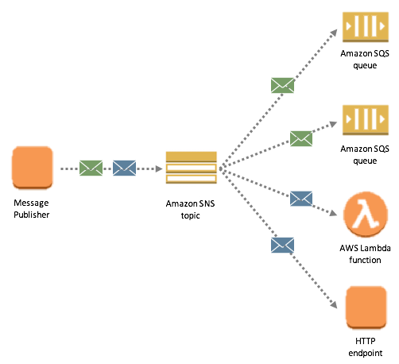
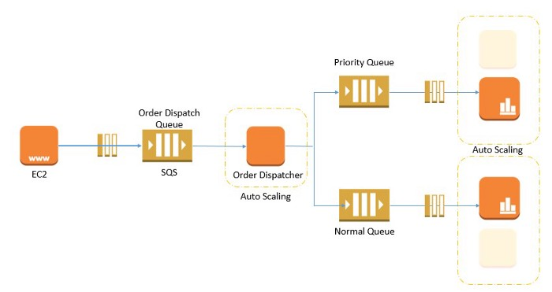

# Readings: AWS: Events

- SQS and SNS are important components for scalable, large scale, distributed, cloud-based applications

 

## SNS (Simple Notification Service)

- SNS is a distributed publish-subscribe service.

- Amazon SNS is a fast, flexible, fully managed push notification service that lets you send individual messages or to bulk messages to large numbers of recipients. 

- Messages are pushed to subscribers as and when they are sent by publishers to SNS.
 

> If you want unknown number and type of subscribers to receive messages, you need SNS.

## SQS (Simple Queue Service)
- SQS is distributed queuing service.

- Messages are not pushed to receivers. 

- Receivers have to poll SQS to receive messages. 

- Messages can’t be received by multiple receivers at the same time. 

- SQS is mainly used to decouple applications or integrate applications. 

- Messages can be stored in SQS for short duration of time (max 14 days).

## what are the key differences?
1. Entity Type

- SQS : Queue.
- SNS : Topic-Subscriber (Pub/Sub system).

2. Persistence

- SQS : Messages are persisted for some duration. The retention period value is from 1 minute to 14 days. The default is 4 days.

- SNS : No persistence. 

## when do we choose SNS vs SQS?
 
> Choose SNS if : 
You would like to be able to publish and consume batches of messages.
 

> Choose SQS if :
You need a simple queue with no particular additional requirements.
 
 

# Review

##  Describe the similarities between AWS API Gateway + Lambda functions and an ExpressJS Server 
- AWS API helps us create the CRUD actions and  the routes.
 

-  Lambda are the serverless functions that trigger from the CRUD. 

- an ExpressJS server is all of them summed in one application.
 
 
 

##  List the AWS Database offerings and talk about the pros and cons of each 

 - link to source: [Database services](https://aws.amazon.com/products/databases/) 

 ### Pros

* integrate with other AWS services
* no hardware maintenance needed
* automated backups

### Cons

* price
* no scale out
* performance is not guaranteed
 
 

##  What’s the difference between a FIFO and a standard queue?
- Standard queues provide at-least-once delivery, which means that each message is delivered at least once. FIFO queues provide exactly-once processing, which means that each message is delivered once and remains available until a consumer processes it and deletes it.
 
 

##  How can the server be assured a message was properly received?
-  The message is stored on the queue until another component called a consumer retrieves the message and does something with it.The client (usually a browser) opens a connection to the server and sends a request.

 - The server processes the request, generates a response, and closes the connection if it finds a Connection: Close header. Headers may provide various information about the request or the client body data.

 
 
 
 

# Terms

- Serverless API : Serverless is a cloud computing execution model where the cloud provider dynamically manages the allocation and provisioning of servers. A serverless application runs in stateless compute containers that are event-triggered, ephemeral (may last for one invocation), and fully managed by the cloud provider.
 
 

- Triggers : Triggers are pieces of code that will automatically respond to any events in DynamoDB Streams.
 

Triggers allow you to build applications that will then react to any data modification made in DynamoDB tables. By enabling DynamoDB Streams on a table, you will be able to associate an ARN with your Lambda function. Instantly after an item in the table is modified, a new record will appear in the table’s stream. When AWS Lambda detects a new stream record, it will invoke your Lambda function synchronously.
 
 

- Dynamo vs Mongo : 

1. MongoDB is vendor agnostic, Open Source, and can be deployed anywhere.
2. DynamoDB is only available on AWS.
3. DynamoDB is a fully managed AWS service, MongoDB can be self installed or fully managed with MongoDB Atlas.
4. DynamoDB as an integrated AWS service makes it easier to develop end to end solutions.
5. DynamoDB uses tables, items and attributes, MongoDB uses JSON-like documents.
6. DynamoDB supports limited data types and smaller item sizes; MongoDB supports more data types and has fewer size restrictions.
 
 

- Dynamoose vs Mongoose : Dynamoose is the model handler for DynamoDB and Mongoose is that for MongoDB.
 
 

 
 

# Preview

### Which 3 things had you heard about previously and now have better clarity on?
- aws console.

### Which 3 things are you hoping to learn more about in the upcoming lecture/demo?
- aws console.

### What are you most excited about trying to implement or see how it works?
- Building an app using aws only.

 
 
 
 

## References:
[SQS and SNS Basics](https://www.youtube.com/watch?v=UesxWuZMZqI)

[AWS SQS vs SNS](https://medium.com/awesome-cloud/aws-difference-between-sqs-and-sns-61a397bf76c5)

[SNS Javascript SDK](https://docs.aws.amazon.com/AWSJavaScriptSDK/latest/AWS/SNS.html)

[SQS Javascript SDK](https://docs.aws.amazon.com/AWSJavaScriptSDK/latest/AWS/SQS.html)