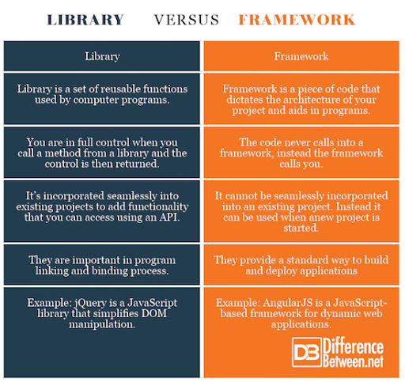

# Reading: Component Based UI


## What is JSX?
-  it is a syntax extension to JavaScript.JSX produces React “elements”.

## Embedding Expressions in JSX
```js
 const element = <h1>Hello, {name}</h1>;
 ```

<br/> 

> Note: You can put any valid JavaScript expression inside the curly braces in JSX. For example, 2 + 2, user.firstName, or formatName(user) are all valid JavaScript expressions.
<br/> 


> Note: you can use JSX inside of if statements and for loops, assign it to variables, accept it as arguments, and return it from functions:

<br/> 


## Review  & research:

### Name 5 Javascript UI Frameworks (other than React):

- Angular.

- Vue.js. 

- Ember.js.

- Meteor. 
 
- Node.js. 

- Polymer.

<br/> 
<br/> 
<br/> 


### What’s the difference between a framework and a library?

- The technical difference between a framework and library lies in a term called inversion of control. When you use a library, you are in charge of the application flow. You choose when and where to call the library. 

- When you use a framework, the framework is in charge of the flow. It provides you with a few places to plug in your code, but it calls the code you plugged in as needed.

<br/>
<br/>


<br/>
<br/>


<br/>
<br/>


## Document the following terms:

- Rendering:  rendering is the process of transforming your react components into DOM (Document Object Model) nodes that your browser can understand and display on the screen.
<br/> 


- Templates: React templates are sets of ready-to-use parts of code built using React technology for the development of dynamic user interfaces.
<br/> 


- State: The state is an instance of React Component Class can be defined as an object of a set of observable properties that control the behavior of the component. In other words, the State of a component is an object that holds some information that may change over the lifetime of the component.
<br/> 
<br/> 
<br/> 


# Preview
#### Which 3 things had you heard about previously and now have better clarity on?
- Redux maybe
<br/> 

#### Which 3 things are you hoping to learn more about in the upcoming lecture/demo?
- how to manipulate states more professionally.
<br/> 


#### What are you most excited about trying to implement or see how it works?
- using new frameworks or libraries.
<br/> 


# References:
- [react hello world](https://facebook.github.io/react/docs/hello-world.html)

- [introducing JSX](https://facebook.github.io/react/docs/introducing-jsx.html)

- [rendering elements](https://facebook.github.io/react/docs/rendering-elements.html)


