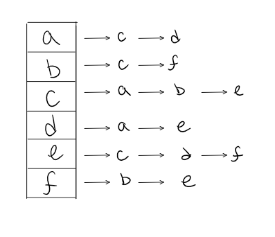

# Implementation: Graphs

# What is a graph ?
- A graph is a non-linear data structure that can be looked at as a collection of vertices (or nodes) potentially connected by line segments named edges.
<br/>
<br/>

# Definitions:

- **Vertex** - A vertex, also called a “node”, is a data object that can have zero or more adjacent vertices.

- **Edge** - An edge is a connection between two nodes.

- **Neighbor** - The neighbors of a node are its adjacent nodes, i.e., are connected via an edge.

- **Degree** - The degree of a vertex is the number of edges connected to that vertex.

<br/>
<br/>

## Directed vs Undirected

- An Undirected Graph is a graph where each edge is undirected or bi-directional. This means that the undirected graph does not move in any direction.


- A Directed Graph also called a Digraph is a graph where every edge is directed.

<br/>
<br/>


**Unlike an undirected graph, a Digraph has direction. Each node is directed at another node with a specific requirement of what node should be referenced next.**

<br/>
<br/>
<br/>
<br/>


## Explain the key difference between the following Graphs: Complete vs Connected vs Disconnected.

- A complete graph is when all nodes are connected to all other nodes.

- A connected graph is graph that has all of vertices/nodes have at least one edge.

- A disconnected graph is a graph where some vertices may not have edges.

<br/>
<br/>


##  whats the difference between Acyclic vs Cyclic Graphs?

- An acyclic graph is a directed graph without cycles.

- A cycle is when a node can be traversed through and potentially end up back at itself.

<br/>
<br/>


## What are the two main Graph Representation?

1. **Adjacency Matrix.**


2. **Adjacency List.**



<br/>
<br/>


## Graphs are extremely popular when it comes to it’s uses. name a few examples of graphs in use.

1. GPS and Mapping.

2. Driving Directions.

3. Social Networks.

4. Airline Traffic.

5. Netflix uses graphs for suggestions of products.

<br/>
<br/>

## What is A weighted graph?
- It is a graph with numbers assigned to its edges. These numbers are called weights. This is what a weighted graph looks like:


<br/>
<br/>


> **The traversals for Graphs are like those of trees.** 

<br/>
<br/>
<br/>
<br/>

## Here is what the algorithm breadth first traversal looks like:

1. Enqueue the declared start node into the Queue.
2. Create a loop that will run while the node still has nodes present.
3. Dequeue the first node from the queue
4. if the Dequeue‘d node has unvisited child nodes, add the unvisited children to visited set and insert them into the queue.

<br/>
<br/>

## Psuedo Code:

```js
ALGORITHM BreadthFirst(vertex)
    DECLARE nodes <-- new List()
    DECLARE breadth <-- new Queue()
    DECLARE visited <-- new Set()

    breadth.Enqueue(vertex)
    visited.Add(vertex)

    while (breadth is not empty)
        DECLARE front <-- breadth.Dequeue()
        nodes.Add(front)
```
<br/>
<br/>

## The algorithm for a depth first traversal is as follows:

1. Push the root node into the stack. 

2. Start a while loop while the stack is not empty.

3. Peek at the top node in the stack.

4. If the top node has unvisited children, mark the top node as visited, and then Push any unvisited children back into the stack.

5. If the top node does not have any unvisited children, Pop that node off the stack.

6. repeat until the stack is empty.

<br/>
<br/>
<br/>
<br/>
<br/>
<br/>

# References:
- [Graphs](https://codefellows.github.io/common_curriculum/data_structures_and_algorithms/Code_401/class-35/resources/graphs.html)