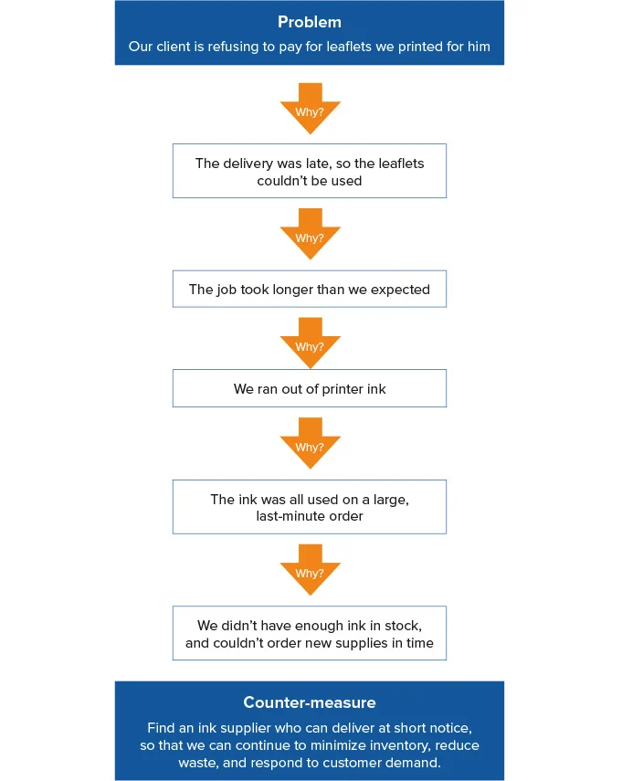

# Pre-Work - Code 401: Advanced Javascript

## 5 Whys

&nbsp;

### When to Use a 5 Whys Analysis
- You can use 5 Whys for troubleshooting, quality improvement, and problem solving, but it is most effective when used to resolve simple or moderately difficult problems.

&nbsp;

### How to Use the 5 Whys
1. Assemble a Team
2. Define the Problem
3. Ask the First "Why?"
4. Ask "Why?" Four More Times
5. Know When to Stop
6. Address the Root Cause(s)
7. Monitor Your Measures

&nbsp;

&nbsp;

&nbsp;

&nbsp;

## How to think like a programmer — lessons in problem solving

-The best way  to solving problems involves:  

    a) having a framework.  

    b) practicing it.

&nbsp;

&nbsp;

## what should you do when you encounter a new problem?

1. Understand the problem
2. Plan (don't jump into coding right away basically)
3. Divide (Never solve a big problem at once, divide it into sub-problems basically)
4. stuck (ask someone and go through everything step by step)
5. practice

&nbsp;

&nbsp;

## How to Solve Programming Problems

### common mistake:
 - Is trying to start writing code as soon as possible.

&nbsp;

&nbsp;

 ## a simple set of steps to follow which you can use for any algorithm type programming problem.

1. Read the problem completely twice.
2. Solve the problem manually with 3 sets of sample data.
3. Optimize the manual steps.
4. Write the manual steps as comments or pseudo-code.
5. Replace the comments or pseudo-code with real code.
6. Optimize the real code.

&nbsp;

> Always : Read the problem completely twice

&nbsp;

&nbsp;

&nbsp;

## References :
---
[1. Solving Problems](https://simpleprogrammer.com/solving-problems-breaking-it-down/)

 [2.How to think like a programmer](https://medium.freecodecamp.org/how-to-think-like-a-programmer-lessons-in-problem-solving-d1d8bf1de7d2)

 [3.The 5 Whys](https://www.mindtools.com/pages/article/newTMC_5W.htm)

 [4.Act like you make $1000/hr](https://medium.com/swlh/pretend-your-time-is-worth-1-000-hour-and-youll-become-100x-more-productive-f04628bb3e6d)

